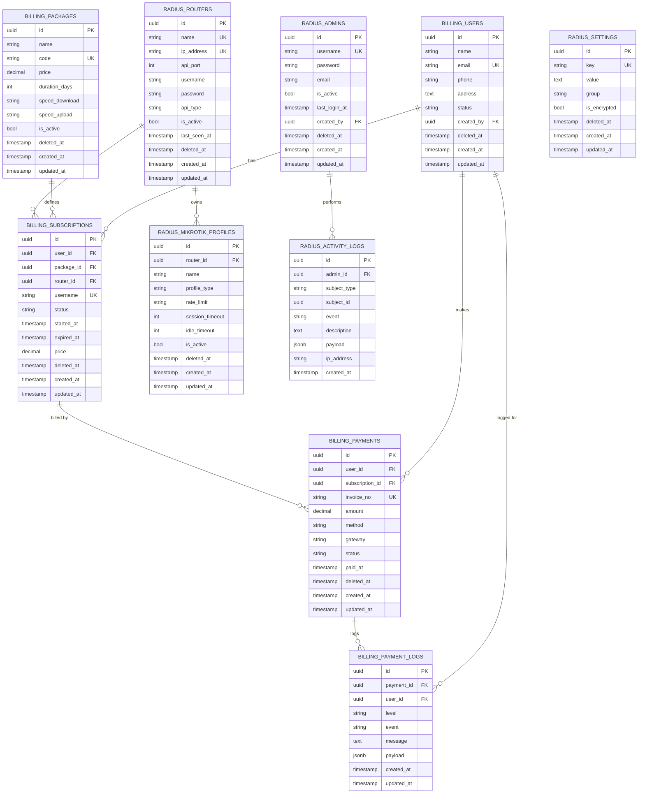

# Hermes ISP Billing — Database ER Diagram

Two PostgreSQL schemas live inside the `hermes_isp` database, owned by the `radius` role:

- **`billing`** — business domain (customers, packages, subscriptions, payments).
- **`radius`** — MikroTik / FreeRADIUS integration (routers, profiles, admins, settings, audit).

All primary and foreign keys are **UUID** (`gen_random_uuid()` default). Soft deletes
(`deleted_at`) are applied on every mutable entity; `payment_logs` and `activity_logs`
are append-only audit tables and are NOT soft-deletable.

> Note: `public.users` (application staff from the auth module) is intentionally
> separate from `billing.users` (customers / subscribers).

## Key relationships

| Child | References | On delete |
|--------|------------|-----------|
| `billing.subscriptions.user_id` | `billing.users.id` | CASCADE |
| `billing.subscriptions.package_id` | `billing.packages.id` | CASCADE |
| `billing.subscriptions.router_id` | `radius.routers.id` | SET NULL |
| `billing.payments.user_id` | `billing.users.id` | CASCADE |
| `billing.payments.subscription_id` | `billing.subscriptions.id` | SET NULL |
| `billing.payment_logs.payment_id` | `billing.payments.id` | CASCADE |
| `billing.payment_logs.user_id` | `billing.users.id` | SET NULL |
| `radius.mikrotik_profiles.router_id` | `radius.routers.id` | SET NULL |
| `radius.activity_logs.admin_id` | `radius.admins.id` | SET NULL |

## Indexes

- `billing.users`: unique `email`, index `phone`, index `status`
- `billing.packages`: unique `code`, index `is_active`
- `billing.subscriptions`: `(user_id, status)`, `package_id`, `status`, `expired_at`
- `billing.payments`: `user_id`, `(subscription_id)`, `method`, `status`, `created_at`
- `billing.payment_logs`: `payment_id`, `user_id`, `level`, `created_at`
- `radius.routers`: unique `ip_address`, unique `name`, index `is_active`
- `radius.mikrotik_profiles`: unique `(router_id, name)`, `profile_type`, `is_active`
- `radius.admins`: unique `username`, index `is_active`
- `radius.settings`: unique `key`
- `radius.activity_logs`: `(subject_type, subject_id)`, `admin_id`, `created_at`
